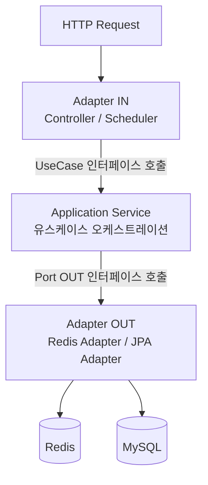
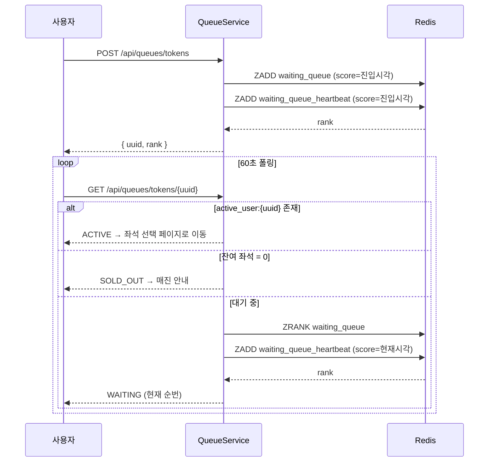
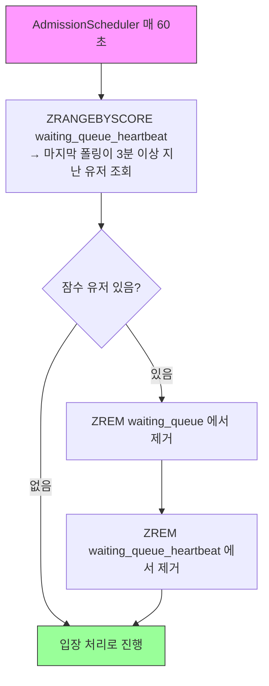
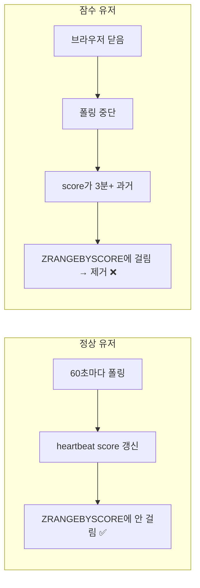
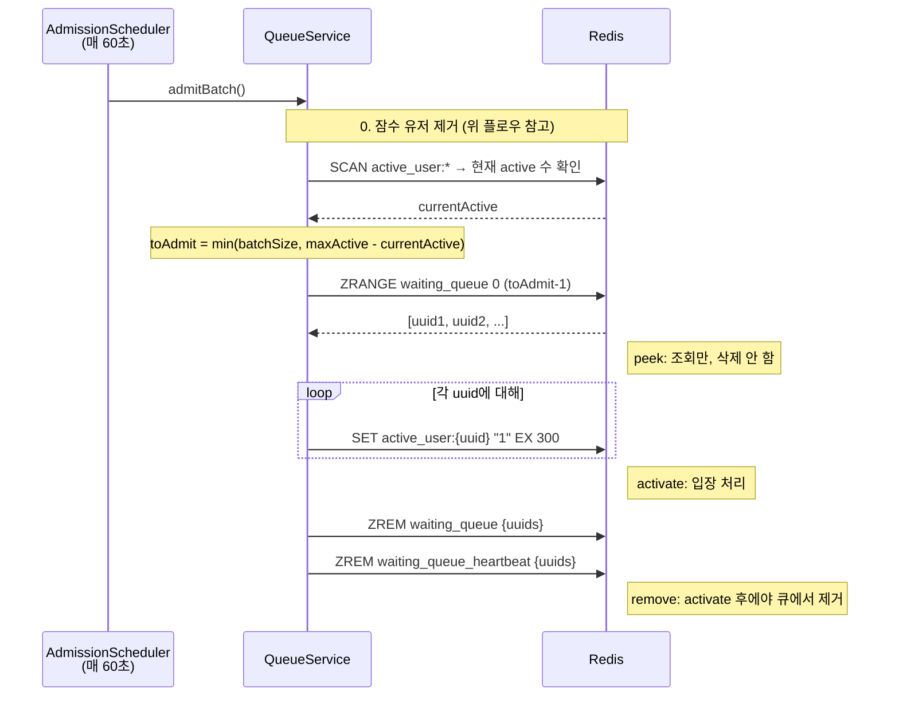
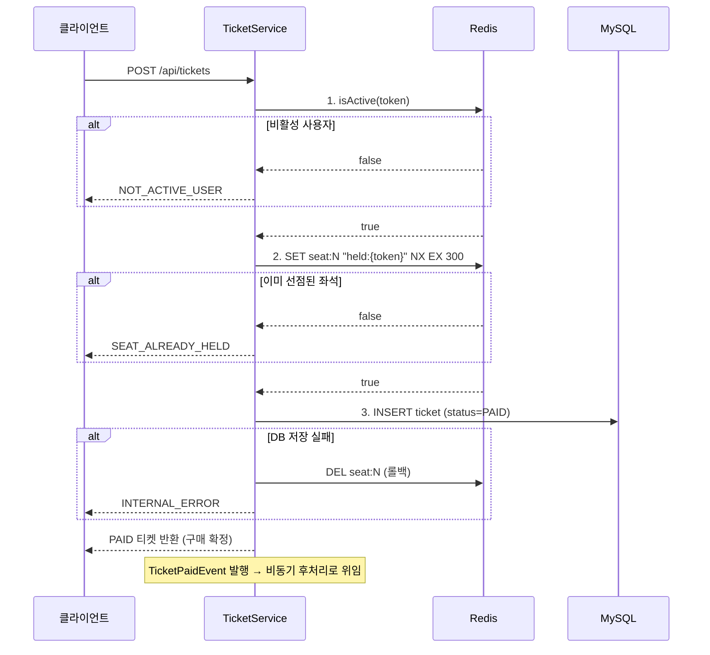
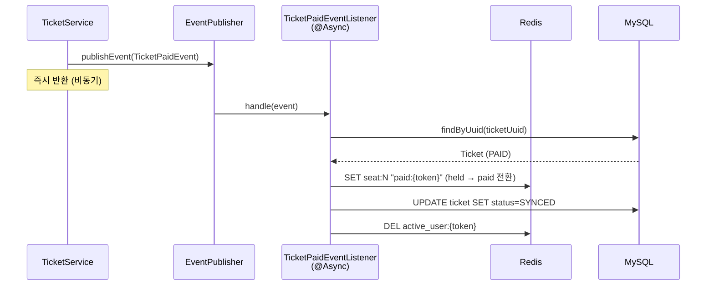
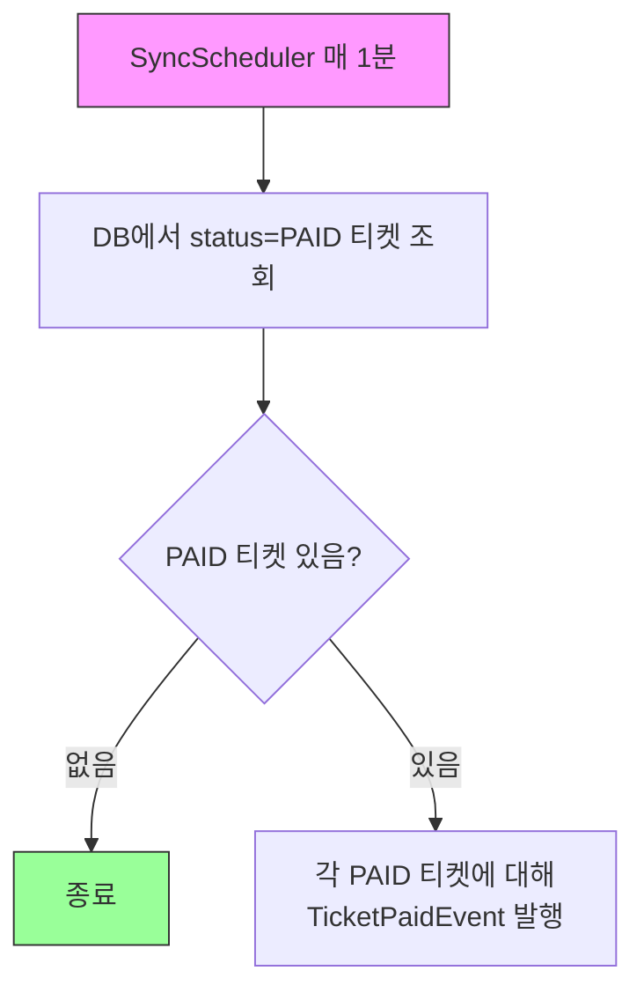

# ZTicket - 대용량 선착순 좌석 티켓 구매 시스템

수백만 명 동시 접속 상황에서 선착순 좌석 티켓 구매를 처리하는 시스템입니다.
Redis 기반 대기열과 비동기 이벤트 동기화 + 배치 복구를 통해
**중복 판매 없는 정합성**과 **높은 처리량**을 동시에 달성합니다.

---

## 목차

1. [기술 스택](#기술-스택)
2. [실행 방법](#실행-방법)
3. [아키텍처 Overview](#아키텍처-overview)
4. [핵심 플로우](#핵심-플로우)
5. [데이터 정합성](#데이터-정합성)
6. [설계 결정](#설계-결정)
7. [부하 테스트 (k6)](#부하-테스트-k6)
8. [모니터링 (Prometheus + Grafana)](#모니터링-prometheus--grafana)
9. [패키지 구조](#패키지-구조)
10. [API 명세](#api-명세)
11. [Redis 키 설계](#redis-키-설계)
12. [설정값](#설정값)

---

## 기술 스택

| 구분 | 기술 | 버전 |
|------|------|------|
| Language | Java | 21 |
| Framework | Spring Boot | 4.0.2 |
| ORM | Spring Data JPA + Hibernate | - |
| Database | MySQL | 8.0 |
| Cache/Queue | Redis | 7 |
| Template | Thymeleaf | - |
| Build | Gradle | 9.3 |
| Container | Docker Compose | - |

---

## 실행 방법

```bash
# 1. 인프라 실행 (MySQL + Redis + Prometheus + Grafana)
docker compose up -d

# 2. 애플리케이션 실행
./gradlew bootRun

# 3. 접속
open http://localhost:8080   # ZTicket
open http://localhost:3000   # Grafana (admin / admin)
```

---

## 아키텍처 Overview

### 헥사고날 아키텍처 (Ports and Adapters)



**핵심 원칙**: domain 패키지는 순수 Java로만 구성되며, Spring/JPA/Redis 등 프레임워크 의존성이 전혀 없습니다. 모든 외부 기술은 adapter 패키지에서 port 인터페이스를 구현하는 방식으로 연결됩니다.

---

## 핵심 플로우

### 1. 대기열 플로우



- **진입 시**: `waiting_queue`(순서 관리)와 `waiting_queue_heartbeat`(생존 감지)에 동시 등록
- **폴링 시**: `waiting_queue_heartbeat`의 score만 현재 시각으로 갱신 (순서를 유지하기 위해 `waiting_queue`는 건드리지 않음)
- **SOLD_OUT 판정**: 잔여 좌석이 0이면 대기열 순번 조회 없이 즉시 SOLD_OUT 반환

### 2. 잠수 유저 제거 플로우

대기열에 진입한 뒤 브라우저를 닫거나 이탈한 유저(잠수 유저)를 자동으로 제거합니다.





### 3. 입장 스케줄러 플로우



**peek → activate → remove 3단계 분리**: peek 후 서버가 죽어도 대기열에 그대로 남아 유실 없음. activate는 멱등 연산이라 재실행해도 TTL만 갱신. activate 완료 후에야 큐에서 제거하므로 "큐에서는 빠졌는데 active는 안 된" 상태가 발생하지 않습니다.

### 4. 구매 플로우: DB PAID 저장까지

> 이 시스템에서는 별도 결제 게이트웨이(PG) 없이, **DB에 티켓을 INSERT하는 것 자체가 결제 완료**를 의미합니다. 실제 서비스라면 PG 연동이 2~3단계 사이에 추가되겠지만, 이 프로젝트는 대기열과 좌석 정합성에 집중하기 위해 결제 과정을 생략했습니다.

구매 요청은 **동기 3단계**로 처리됩니다. DB에 PAID 티켓이 저장되는 것이 구매 확정이며, 이 시점에서 클라이언트에 응답이 나갑니다.



**DB PAID = Source of Truth**: 클라이언트는 DB에 PAID가 저장되면 구매 성공입니다. 이후 Redis 동기화는 비동기로 처리되며, 실패해도 구매 결과에 영향을 주지 않습니다.

### 5. 비동기 Redis 동기화: @Async 이벤트

DB에 PAID 저장 후, `TicketPaidEvent`가 발행됩니다. `TicketPaidEventListener`가 `@Async`로 후처리를 수행합니다. 실패해도 구매 응답에 영향이 없습니다.



### 6. 동기화 배치 복구: PAID 티켓 재동기화

5단계 비동기 처리가 실패하면 DB에 PAID 상태로 남습니다. 동기화 배치(`SyncScheduler`, 매 1분)가 이를 감지하여 동일한 `TicketPaidEvent`를 발행합니다. 리스너의 로직은 멱등하므로 몇 번을 재실행해도 동일한 결과를 보장합니다.



**DB PAID가 Source of Truth**: Redis는 장애나 TTL 만료로 상태가 유실될 수 있지만, DB에 PAID로 기록된 티켓은 확정된 사실입니다. 동기화 배치는 DB의 PAID 레코드를 기준으로 Redis 상태를 복원합니다.

---

## 데이터 정합성

이 시스템의 가장 어려운 문제는 **Redis와 DB 간의 상태 불일치**입니다. 두 저장소에 걸친 연산은 분산 트랜잭션이 불가능하므로, 장애 시나리오별 대응 전략을 설계했습니다.

### 1. Redis-DB 장애 시나리오와 복구

#### Case 1: Redis held 성공 → DB INSERT 실패

- **사용자 응답**: INTERNAL_ERROR (구매 실패)
- **상태**: Redis `held:{token}` (TTL 째깍째깍) + DB 레코드 없음
- 구매가 확정되지 않은 상태이므로 catch 블록에서 즉시 `DEL seat:{n}`으로 롤백합니다.
- 롤백마저 실패해도 held 키의 TTL(5분)이 자동 해제합니다.
- **중복 판매 불가능**: DB에 레코드 자체가 없으므로 판매된 적이 없습니다.

#### Case 2: DB PAID 성공 → 비동기 Redis paid 전환 실패 (또는 서버 사망)

- **사용자 응답**: 구매 성공 (PAID 티켓 반환 완료)
- **상태**: Redis `held:{token}` (TTL 째깍째깍) + DB `PAID`
- Redis에 아직 held 상태이므로 TTL 만료 시 다른 사용자에게 빈 좌석으로 노출될 수 있습니다.
- 동기화 배치가 1분마다 PAID 티켓을 조회하여 `SET seat:{n} paid:{token}`으로 Redis를 복원합니다.
- **중복 판매 불가능**: 설령 TTL 만료 후 다른 사용자가 hold하더라도, DB INSERT 시 `seat_number UNIQUE` 제약에 의해 거부됩니다.

#### Case 3: Redis paid 성공 → DB SYNCED 갱신 실패

- **사용자 응답**: 구매 성공 (PAID 티켓 반환 완료)
- **상태**: Redis `paid:{token}` (영구) + DB `PAID`
- 동기화 배치가 paySeat을 재실행하지만, 이미 paid이므로 동일한 값을 덮어쓸 뿐입니다(멱등). 이후 DB를 SYNCED로 갱신합니다.
- **중복 판매 불가능**: Redis가 이미 paid로 영구 점유 중이라 다른 사용자의 hold가 불가능합니다.

#### Case 4: DB SYNCED 성공 → active 유저 제거 실패

- **사용자 응답**: 구매 성공 (PAID 티켓 반환 완료)
- **상태**: Redis `paid:{token}` (영구) + DB `SYNCED` + `active_user:{token}` 잔존
- 구매와 동기화는 완료된 상태이며, active 슬롯만 5분간 불필요하게 점유됩니다.
- `active_user` 키에 TTL(5분)이 걸려 있어 별도 처리 없이 자동 만료됩니다.

#### 핵심 불변식

- `동기화 배치 주기(1분) < hold TTL(5분)` → TTL 만료 전에 동기화가 완료됩니다.

---

### 2. 좌석 선점: `SET NX EX`

"키가 없을 때만 생성"이라는 단순한 조건이므로, Redis 네이티브 명령 하나로 원자적으로 처리됩니다.

```java
// SeatHoldRedisAdapter.java
Boolean success = redisTemplate.opsForValue()
        .setIfAbsent(key, "held:" + uuid, ttlSeconds, TimeUnit.SECONDS);
```

---

### 3. 대기열 입장: 잠수 제거 → peek → activate → remove

#### 잠수 유저 제거 (Sorted Set 기반)

대기열에 진입한 뒤 브라우저를 닫거나 이탈한 유저(잠수 유저)를 자동으로 제거한다.

```
waiting_queue           (score = 진입 시각)      → FIFO 순서 유지, rank 조회용
waiting_queue_heartbeat (score = 마지막 폴링 시각) → 잠수 감지 및 제거용
```

**동작 흐름**:

| 시점 | waiting_queue | waiting_queue_heartbeat |
|------|--------------|------------------------|
| 진입 (`POST /api/queues/tokens`) | ZADD {진입시각} | ZADD {진입시각} |
| 폴링 (`GET /api/queues/tokens/{uuid}`) | 안 건드림 | ZADD {현재시각} |
| 잠수 제거 (`AdmissionScheduler.admit()`) | ZREM | ZREMRANGEBYSCORE |
| 입장 (`AdmissionScheduler.admit()`) | ZREM | ZREM |

**왜 Sorted Set 2개?**
- `waiting_queue`의 score를 폴링 시각으로 갱신하면 FIFO 순서가 깨져서 rank가 매 폴링마다 뒤바뀐다.
- 진입 순서(rank)와 생존 여부(heartbeat)는 별개 관심사이므로 분리했다.
- 개별 키(`queue_hb:{uuid}`) N개 대신 Sorted Set 1개로 관리. 키스페이스를 오염시키지 않는다.

**시간복잡도** (N = 대기열 인원, M = 제거 대상 수):

| 연산 | 명령 | 복잡도 | 빈도 |
|------|------|--------|------|
| 진입 | ZADD × 2 | O(log N) | 유저당 1회 |
| 폴링 heartbeat 갱신 | ZADD × 1 | O(log N) | 유저당 2초마다 |
| 잠수 감지 | ZRANGEBYSCORE | O(log N + M) | 스케줄러 주기마다 |
| 잠수 제거 | ZREM × 2 | O(M log N) | 스케줄러 주기마다 |
| rank 조회 | ZRANK | O(log N) | 유저당 2초마다 |

100만 명 대기 시 log(1M) ≈ 20. 폴링으로 추가되는 ZADD는 유저당 2초마다 1회이므로, 대기자 10만 명이면 ~5만 ops/s 추가. Redis 단일 인스턴스(~10만 ops/s)에서 충분히 처리 가능하다.

#### 입장 후 잠수 유저

입장 후 구매하지 않는 잠수 유저는 `active_user:{uuid}` 키의 TTL(300초)로 자연 회수된다. 5분 뒤 자동 만료되어 슬롯이 반환된다.

#### 입장 제어 (admitBatch)

```java
// QueueService.java
// 0. 잠수 유저 제거 (queue-ttl-seconds 동안 폴링 없는 유저)
waitingQueuePort.removeExpired(System.currentTimeMillis() - queueTtlMs);

// 1~3. 입장 처리
long currentActive = activeUserPort.countActive();
int slotsAvailable = (int) Math.max(0, maxActiveUsers - currentActive);
int toAdmit = Math.min(batchSize, slotsAvailable);

List<String> candidates = waitingQueuePort.peekBatch(toAdmit);   // 1. 조회만 (삭제 안 함)
for (String uuid : candidates) {
    activeUserPort.activate(uuid, activeTtlSeconds);              // 2. active_user 키 생성
}
waitingQueuePort.removeBatch(candidates);                         // 3. 큐에서 제거
```

**입장 제어**: 매 주기마다 active 유저 수를 세고, `maxActiveUsers - currentActive` 만큼만 입장시킨다. 잠수 유저가 TTL 만료로 빠지면 그만큼 다음 주기에 새 유저가 들어온다.

**active 유저 카운트 — SCAN 사용 이유**: `active_user:{uuid}` 패턴의 키 수를 세야 하는데, Redis에는 접두사 인덱스가 없다. `KEYS`는 블로킹, `SCAN`은 커서 기반 논블로킹. `SCAN`은 정확한 값을 보장하지 않지만, 입장 제어에는 정확한 수가 필요 없다. 다소 많거나 적게 입장시켜도 다음 주기에 보정된다.

키스페이스가 수만 개 이상이면 `SCAN`도 부담이 된다. Sorted Set(score=만료 시각)으로 바꾸면 `ZCARD` O(1)로 카운트 가능. 단, TTL 자동 만료 대신 만료 시각을 직접 관리해야 한다.

**peek → activate → remove 3단계 분리**:

- **peek**: 큐에서 꺼내지 않고 조회만. 서버가 죽어도 대기열에 그대로 남아서 유실 없음.
- **activate**: `active_user:{uuid}` 키 생성. 멱등 연산이라 재실행해도 TTL만 갱신. 서버가 죽으면 다음 주기에 다시 처리.
- **remove**: activate 완료 후에야 큐에서 제거. "큐에서는 빠졌는데 active는 안 된" 상태가 안 생긴다.

---

## 설계 결정

### 1. 아키텍처: 헥사고날 vs 레이어드

#### 레이어드 아키텍처의 문제

전통적인 레이어드 아키텍처는 `Controller → Service → Repository`로 구성됩니다. 레이어 간 경계가 인터페이스 없이 구체 클래스로 직접 연결되어 있습니다.

```
Controller → Service (구체 클래스) → Repository (구체 클래스)
                ↓                        ↓
           @Entity 도메인             JPA 직접 의존
```

이 구조에서는 다음과 같은 문제가 발생합니다:

- **도메인이 인프라에 오염**: `Ticket.java`에 `@Entity`, `@Column` 같은 JPA 어노테이션이 직접 붙습니다. 도메인 객체가 JPA에 종속되어, DB를 교체하면 도메인 코드까지 수정해야 합니다.
- **테스트 시 인프라 의존**: Service가 Repository 구체 클래스에 직접 의존하므로, 단위 테스트에서 Redis/MySQL 없이 로직만 테스트하기 어렵습니다.
- **의존성 방향이 아래로만 흐름**: `Controller → Service → Repository → DB`. 상위 레이어가 하위 레이어의 구현을 알게 됩니다.

#### 선택: 헥사고날 아키텍처 (Ports and Adapters) + 도메인 단위 패키지

```
queue/           → 대기열 도메인 (domain + application + adapter)
seat/            → 좌석 도메인 (domain + application + adapter)
ticket/          → 티켓 도메인 (domain + application + adapter)
각 도메인 내:
  domain/        → 순수 Java (QueueToken, Ticket, SeatStatus)
  application/   → 유스케이스 오케스트레이션 + Port 인터페이스
  adapter/       → Controller, Scheduler, Redis/JPA Adapter
```

헥사고날 아키텍처는 **DIP(의존성 역전 원칙)**와 **객체 변환**을 통해 레이어드의 문제를 해결합니다.

**1) Port 인터페이스로 의존성 역전**

Service가 Repository 구체 클래스에 직접 의존하는 대신, application 패키지에 Port 인터페이스를 정의하고 adapter가 이를 구현합니다. 의존성 방향이 역전되어 인프라(adapter)가 도메인(application)에 의존하게 됩니다.

```
레이어드:    Controller → Service → Repository (구체)     의존성: 위 → 아래
헥사고날:    Controller → UseCase(Port) ← Service → Port(인터페이스) ← Adapter
             adapter/in    port/in      application     port/out       adapter/out
```

**2) Adapter에서 JPA Entity ↔ 도메인 객체 변환**

레이어드에서는 `@Entity`가 붙은 JPA 엔티티를 Service까지 그대로 올려보냅니다. 도메인 객체 자체가 JPA에 종속됩니다. 헥사고날에서는 Adapter가 경계에서 JPA 엔티티를 도메인 객체로 변환하여 반환합니다. Port 인터페이스의 반환 타입이 도메인 객체(`Ticket`)이므로, 도메인은 JPA의 존재를 알 수 없습니다.

```
레이어드:    Repository → TicketEntity(@Entity) → Service → Controller
             JPA 엔티티가 도메인까지 그대로 노출

헥사고날:    TicketJpaAdapter → TicketJpaEntity(@Entity) → toDomain() → Ticket(순수 Java)
             Adapter 내부에서 변환, Port 밖으로는 도메인 객체만 나감
```

```java
// TicketJpaAdapter.java - Port 구현체
public Ticket save(Ticket ticket) {
    TicketJpaEntity entity = TicketJpaEntity.fromDomain(ticket);  // 도메인 → JPA
    return repository.save(entity).toDomain();                     // JPA → 도메인
}
```

이 두 가지 메커니즘(DIP + 객체 변환)으로 레이어드의 세 가지 문제를 해결합니다:

**채택 이유**:
- **도메인 순수성**: Port 인터페이스가 경계를, Adapter의 객체 변환이 분리를 만듭니다. `Ticket.java`에 `@Entity` 같은 JPA 어노테이션이 없습니다. Redis를 Memcached로, MySQL을 PostgreSQL로 교체해도 domain 패키지는 한 줄도 수정하지 않습니다.
- **테스트 용이성**: Port 인터페이스 덕분에 단위 테스트에서 Mock으로 교체할 수 있습니다. `TicketService`는 `SeatHoldPort`와 `TicketPort`만 Mock하면 Redis/MySQL 없이도 구매 로직을 완벽히 테스트할 수 있습니다.
- **의존성 방향 제어**: DIP에 의해 모든 의존성이 domain을 향합니다 (`adapter → application → domain`). domain은 어디에도 의존하지 않습니다.
- **경계의 명시성**: `port/in`, `port/out`, `adapter/in`, `adapter/out`이라는 패키지 구조가 안쪽(도메인)과 바깥쪽(인프라)의 경계를 명확히 드러냅니다.

**트레이드오프**:
- **파일 수 증가**: `SeatHoldPort`(인터페이스) + `SeatHoldRedisAdapter`(구현)처럼 인터페이스-구현 쌍이 반드시 필요합니다. 레이어드라면 `SeatHoldService` 하나로 끝납니다.
- **간접 참조 비용**: Controller → UseCase 인터페이스 → Service → Port 인터페이스 → Adapter. 호출 체인이 길어져 코드를 따라가기 어려울 수 있습니다.
- **매핑 코드 추가**: Adapter마다 `fromDomain()`과 `toDomain()` 변환 코드가 필요합니다. 레이어드에서는 `@Entity` 객체를 그대로 사용하므로 이 코드가 없습니다.

---

### 2. 대기열: Redis Sorted Set vs 메시지 큐 (Kafka/RabbitMQ)

#### 선택: Redis Sorted Set (`ZADD`, `ZRANK`, `ZRANGE + ZREM`)

**채택 이유**:
- **실시간 순번 조회**: `ZRANK`는 O(log N)으로 즉시 현재 순번을 반환합니다. 클라이언트가 2초마다 폴링할 때 "현재 347번째"를 바로 응답할 수 있습니다. Kafka에서는 consumer offset으로 순번을 계산하는 것이 불가능에 가깝습니다.
- **배치 입장의 단순성**: `ZRANGE(0, 59)` + `ZREM`으로 상위 60명을 원자적으로 추출합니다.
- **인프라 단순성**: 이미 좌석 선점용으로 Redis를 사용하므로, 별도 인프라를 추가하지 않습니다.

**트레이드오프**:
- **메모리**: UUID 멤버 기준 `waiting_queue` + `waiting_queue_heartbeat` 합산 유저당 ~250bytes. 1,000만 명이면 ~2.5GB로 단일 인스턴스에서 충분합니다. 다만 대기자가 많아질수록 폴링에 의한 ops/s가 증가하므로(1,000만 명 × 60초 폴링 = ~17만 ops/s), Redis 싱글 스레드 처리량 한계(~10만 ops/s)에 도달할 수 있습니다. 대응 방법은 두 가지입니다:
  - **폴링 주기 늘리기**: 60초 → 120초로 변경하면 ~17만 → ~8만 ops/s로 감소. 인프라 변경 없이 설정값만 조정하면 되지만, 입장 알림이 최대 120초까지 지연됩니다.
  - **Redis Cluster 샤딩**: 처리량 자체를 수평 확장. 폴링 주기를 유지하면서 대규모 대기열을 처리할 수 있지만, 인프라 복잡도가 증가합니다.
- **영속성 부재**: Redis 장애 시 대기열 유실. 다만 선착순 대기열은 일시적 데이터이므로 재진입이 합리적.
- **순서 보장 범위**: `System.currentTimeMillis()` 기반 score는 밀리초 내 동시 요청 시 순서가 불확실하지만, 밀리초 내 차이는 공정성 기준에서 무시 가능.

---

### 3. 1티켓-1좌석: 단일 좌석 vs 다중 좌석 선택

#### 선택: 1티켓 = 1좌석 (`seatNumber: int`)

```java
// Ticket.java
private final int seatNumber;  // List<Integer> seatNumbers가 아님
```

**채택 이유**:
- **본질에 집중**: 이 프로젝트의 핵심은 대용량 동시 접속 환경에서의 선착순 티켓 구매 시스템입니다. 다중 좌석 선택은 부가 기능이지 핵심 도메인이 아닙니다. 대기열 관리, Redis-DB 동기화, 중복 판매 방지 등 핵심 문제에 집중하기 위해 의도적으로 제외했습니다.

---

### 4. 영속화 패턴: 도메인 객체 `save(ticket)` vs 직접 `updateStatus(uuid, status)`

#### 선택: 도메인 엔티티에서 상태 전이 후 save

```java
// TicketService.java - 상태 전이는 도메인 엔티티가 담당
ticket.sync();                       // Ticket 내부에서 PAID→SYNCED 전환 + 유효성 검증
ticketPort.save(ticket);  // 변경된 도메인 객체를 그대로 저장
```

```java
// TicketJpaAdapter.java - Upsert 패턴
public Ticket save(Ticket ticket) {
    TicketJpaEntity entity = ticket.getId() != null
            ? repository.findById(ticket.getId())
                    .map(existing -> { existing.update(ticket); return existing; })
                    .orElseThrow(() -> new IllegalStateException(
                            "티켓을 찾을 수 없습니다: id=" + ticket.getId()))
            : TicketJpaEntity.fromDomain(ticket);
    return repository.save(entity).toDomain();
}
```

**채택 이유**:
- **도메인 로직 캡슐화**: 상태 전이 규칙(PAID→SYNCED만 허용)이 `Ticket.sync()` 메서드 안에 있습니다. `updateStatus(uuid, SYNCED)`는 어디서든 아무 상태로나 변경할 수 있어 도메인 불변식이 깨질 수 있습니다.
- **Port 인터페이스 단순화**: `TicketPort`에 `save`, `findByUuid`, `findByStatus` 3개 메서드만 있습니다. `updateStatus`가 없으므로 포트가 더 범용적입니다.
- **Upsert 패턴**: 같은 `save()` 메서드로 INSERT(첫 저장)와 UPDATE(상태 변경)를 모두 처리합니다.

**트레이드오프**:
- **Upsert의 추가 SELECT**: 매 save마다 `findById`를 먼저 실행합니다. 직접 `UPDATE ... WHERE id = ?`보다 한 번의 SELECT가 추가됩니다. 하지만 PK 조회이므로 성능 차이는 미미합니다.
- **도메인 엔티티 외부 수정 불가**: `ticket.setStatus()`가 없으므로 테스트에서 임의 상태를 주입하려면 생성자를 사용해야 합니다.

---

### 5. 클라이언트 통신: 폴링 vs WebSocket vs SSE

#### 선택: 60초 주기 HTTP 폴링

**WebSocket / SSE를 사용하지 않는 이유**:
- **WebSocket**: 서버가 각 클라이언트와 상시 TCP 연결을 유지해야 합니다. 대기자 50만 명이면 50만 개의 커넥션이 동시에 열려있어야 하고, 로드밸런서에서 같은 클라이언트를 같은 서버로 라우팅하는 sticky session 설정이 필요합니다.
- **SSE(Server-Sent Events)**: WebSocket보다 단순하지만 마찬가지로 서버가 HTTP 연결을 끊지 않고 유지합니다. 대규모 동시 접속에서 커넥션 수 문제는 동일합니다.

**폴링 채택 이유**:
- **연결을 유지하지 않음**: 요청-응답 후 즉시 커넥션이 반환됩니다. 50만 명이 대기해도 동시 커넥션 수는 폴링 주기에 비례한 일부분만 차지합니다.
- **인프라 단순성**: 일반 REST API이므로 별도 설정 없이 모든 로드밸런서/CDN과 호환됩니다.

**트레이드오프**:
- **불필요한 요청**: 순번 변화가 없어도 60초마다 요청을 보냅니다. 대기자 50만 명 × ~0.017 req/s = ~8,300 req/s.
- **최대 60초 지연**: 입장이 허용된 직후부터 최대 60초 후에야 클라이언트가 인지합니다.

---

## 부하 테스트 (k6)

[k6](https://grafana.com/docs/k6/)를 사용하여 부하 테스트합니다. 두 가지 시나리오를 제공합니다.

```bash
brew install k6
```

### 1. 전체 플로우 시나리오 (`full-flow.js`)

대기열 진입 → 폴링 → 좌석 조회 → 구매까지 실제 사용자와 동일한 플로우를 시뮬레이션합니다 (`per-vu-iterations`, VU당 1회 실행).

```
VU 동시 시작 (각 VU 1회만 실행)
    │
    ├── 1. POST /api/queues/tokens        대기열 진입, UUID 발급
    │
    ├── 2. GET /api/queues/tokens/{uuid}   60초 폴링, ACTIVE까지 대기
    │       (반복)
    │
    ├── 3. GET /api/seats                  빈 좌석 조회
    │
    └── 4. POST /api/tickets               랜덤 빈 좌석 구매
```

```bash
k6 run k6/full-flow.js
```

| 커스텀 메트릭 | 설명 |
|--------------|------|
| `purchase_success` | 구매 성공 수 |
| `purchase_fail` | 구매 실패 수 (좌석 충돌 등) |
| `queue_wait_time` | 대기열 진입 → ACTIVE까지 소요시간 |

### 2. 스트레스 테스트 (`enter-stress.js` + `queue-stress.js`)

두 스크립트를 동시에 실행하여 진입과 폴링을 동시에 부하를 줍니다.

| 스크립트 | VU | 동작 | 종료 조건 |
|---------|-----|------|----------|
| `enter-stress.js` | 500 | `POST /api/queues/tokens` 무한 반복 | 10분 경과 |
| `queue-stress.js` | 4,500 | 토큰 1개 발급 후 `GET /api/queues/tokens/{uuid}` 무한 폴링 (ACTIVE/SOLD_OUT 시 1회 작업 종료) | 10분 경과 |

```bash
# 터미널 2개에서 동시에 실행
k6 run k6/enter-stress.js &
k6 run k6/queue-stress.js &
```

### 부하 테스트 결과

> 단일 머신(MacBook Pro, Apple M4 Max / 32GB)에서 앱 + k6 + Docker(Redis, MySQL, Prometheus, Grafana)를 동시에 실행한 환경.
> k6 VU의 JS 런타임 오버헤드와 CPU 경합이 있으므로, 실 운영 대비 보수적인 수치입니다.

**테스트 조건**: enter-stress 500 VU + queue-stress 4,500 VU (합계 5,000 VU)

#### HTTP

| 엔드포인트 | 처리량              | p95 | p99 | p99.9 | 에러율 |
|-----------|------------------|-----|-----|-------|-------|
| `POST /api/queues/tokens` | 1.6K req/s       | 20ms | 33ms | 62ms | 0% |
| `GET /api/queues/tokens/{uuid}` | 14K req/s        | 20ms | 33ms | 62ms | 0% |
| **합계** | **~15.6K req/s** | | | | **0%** |

#### Redis

| 명령 | p95 | p99 | p99.9 | 용도 |
|------|-----|-----|-------|------|
| ZADD | 3.7ms | 5.5ms | 25ms | 대기열 진입 |
| ZRANK | 3.7ms | 5.5ms | 25ms | 순번 조회 |
| EXISTS | 4.0ms | 5.8ms | 26ms | active 토큰 확인 |
| ZRANGEBYSCORE | 5.7ms | 6.7ms | 7.0ms | 잠수 유저 탐색 (5,000건 배치) |
| ZREM | 8.7ms | 11ms | 11ms | 잠수 유저 제거 (5,000건 배치) |
| **전체** | | | | **45K ops/s** |

#### 시스템 리소스

| 지표 | 값 | 비고 |
|------|-----|------|
| Tomcat Threads | 200 / 200 | 포화 (병목 지점) |
| Process CPU | 35% | 앱 자체는 여유 |
| System CPU | 87% | k6와 CPU 경합 |
| JVM Heap | 312MB / 9,216MB | 여유 |

#### 분석

- **처리량**: Tomcat 200 스레드로 15.6K req/s를 처리. 스레드가 포화 상태이므로 `server.tomcat.threads.max`를 늘리면 처리량 증가 예상.
- **응답 시간**: p99 33ms, p99.9 62ms. Redis 단일 명령은 대부분 p99 6ms 이내. 잠수 유저 제거(ZREM)는 5,000건 배치 처리로 p99 11ms.
- **에러율**: 0%. 대기열 진입과 폴링 모두 에러 없음.
- **병목**: Tomcat 스레드 포화 + 단일 머신 CPU 경합. Redis와 DB는 여유.

#### 실 서비스 환산

| 지표 | 수치 | 의미 |
|------|------|------|
| 진입 처리 | 1.6K명/초 | 1분에 ~9.3만 명 대기열 진입 가능 |
| 폴링 수용 | 14K req/s | 60초 폴링 기준 **~84만 명** 동시 대기 가능 |
| 응답 시간 | p99 33ms, p99.9 62ms | 사용자 체감 없음 |

단일 인스턴스, 기본 설정(Tomcat 200 스레드) 기준입니다. k6와 앱이 같은 머신에서 CPU를 경합하는 환경이므로, 분리 시 더 높은 수치가 나올 것으로 예상됩니다.

---

## 모니터링 (Prometheus + Grafana)

Spring Boot Actuator + Micrometer로 메트릭을 수집하고, Prometheus + Grafana로 시각화합니다.

### 구성

```
App (Actuator /actuator/prometheus)
    │
    │  10초 주기 스크래핑
    ▼
Prometheus (:9090)
    │
    │  데이터소스
    ▼
Grafana (:3000)  →  ZTicket 대시보드 (자동 프로비저닝)
```

`docker compose up -d` + `./gradlew bootRun` 후 [localhost:3000](http://localhost:3000)에서 `ZTicket Monitoring` 대시보드가 자동 프로비저닝되어 있습니다.

### 대시보드 패널

| 패널 | 설명 |
|------|------|
| HTTP Request Rate | 엔드포인트별 초당 요청 수 |
| HTTP Response Time (p95) | 상위 5% 응답 시간 |
| HTTP Response Time (p99) | 상위 1% 응답 시간 |
| HTTP Response Time (p99.9) | 상위 0.1% 응답 시간 |
| HTTP Error Rate | 4xx/5xx 비율 |
| Tomcat Threads | busy/current/max 스레드 수 |
| HikariCP Connections | DB 커넥션풀 active/idle/pending |
| HikariCP Acquire Time | DB 커넥션 획득 대기 시간 |
| JVM Heap Memory | 힙 메모리 사용량 |
| GC Pause Time | GC 멈춤 시간 |
| CPU Usage | process/system CPU 사용률 |
| JVM Threads | 라이브/피크 스레드 수 |
| Redis Command Rate | 명령별 초당 처리량 (ops/s) |
| Redis Latency (p95) | 상위 5% 명령 응답 시간 |
| Redis Latency (p99) | 상위 1% 명령 응답 시간 |
| Redis Latency (p99.9) | 상위 0.1% 명령 응답 시간 |

### Actuator 엔드포인트

| Path | 설명 |
|------|------|
| `/actuator/prometheus` | Prometheus 포맷 메트릭 |
| `/actuator/health` | 앱 + DB + Redis 헬스체크 |
| `/actuator/metrics` | 전체 메트릭 목록 |

---

## 패키지 구조

도메인(queue, seat, ticket)이 최상위 패키지가 되고, 각 도메인 안에 레이어(domain, application, adapter)가 배치되는 구조입니다.

```
kr.jemi.zticket
├── ZticketApplication.java                     @EnableScheduling
│
├── queue/                                      대기열 도메인 (독립)
│   ├── domain/
│   │   ├── QueueToken.java                     record(uuid, rank, status)
│   │   └── QueueStatus.java                    enum: WAITING, ACTIVE, SOLD_OUT
│   ├── application/
│   │   ├── port/
│   │   │   ├── in/
│   │   │   │   ├── EnterQueueUseCase.java         대기열 진입
│   │   │   │   ├── GetQueueTokenUseCase.java      토큰 상태·순번 조회
│   │   │   │   └── AdmitUsersUseCase.java         대기 → active 배치 입장
│   │   │   └── out/
│   │   │       ├── WaitingQueuePort.java          대기열 Sorted Set 조작
│   │   │       └── ActiveUserPort.java            active 유저 SET 조작
│   │   └── QueueService.java                      대기열 비즈니스 로직
│   └── adapter/
│       ├── in/
│       │   ├── web/
│       │   │   ├── QueueApiController.java     /api/queues/tokens/**
│       │   │   └── dto/
│       │   │       ├── TokenResponse.java              진입 응답 (uuid)
│       │   │       └── QueueStatusResponse.java        폴링 응답 (status, rank)
│       │   └── scheduler/
│       │       └── AdmissionScheduler.java     60초 배치 입장 + 잠수 유저 제거
│       └── out/
│           └── redis/
│               ├── WaitingQueueRedisAdapter.java  Sorted Set 기반 대기열
│               └── ActiveUserRedisAdapter.java    SET 기반 active 관리
│
├── seat/                                       좌석 도메인 (독립)
│   ├── domain/
│   │   ├── SeatStatus.java                     enum: AVAILABLE, HELD, PAID, UNKNOWN
│   │   ├── Seat.java                           좌석 상태 + 소유자 (도메인 객체)
│   │   └── Seats.java                          좌석 상태 맵 래퍼
│   ├── application/
│   │   ├── port/
│   │   │   ├── in/
│   │   │   │   └── GetSeatsUseCase.java           좌석 현황 조회
│   │   │   └── out/
│   │   │       └── SeatHoldPort.java           hold/pay/release/getStatuses
│   │   └── SeatService.java                    좌석 현황 조회
│   └── adapter/
│       ├── in/
│       │   └── web/
│       │       ├── SeatApiController.java      /api/seats, /api/seats/available-count
│       │       └── dto/
│       │           ├── SeatStatusResponse.java         좌석별 상태
│       │           └── AvailableCountResponse.java    잔여 좌석 수
│       └── out/
│           └── redis/
│               ├── SeatHoldRedisAdapter.java   holdSeat(setIfAbsent) + paySeat(SET)
│               └── RedisSeat.java             Redis 값 파싱 DTO
│
├── ticket/                                     티켓 도메인 (→ queue, seat 의존)
│   ├── domain/
│   │   ├── Ticket.java                         도메인 엔티티
│   │   ├── TicketStatus.java                   enum: PAID, SYNCED
│   │   └── TicketPaidEvent.java                record(ticketUuid) - 비동기 후처리 이벤트
│   ├── application/
│   │   ├── port/
│   │   │   ├── in/
│   │   │   │   ├── PurchaseTicketUseCase.java  purchase(queueToken, seatNumber)
│   │   │   │   └── SyncTicketUseCase.java      syncPaidTickets()
│   │   │   └── out/
│   │   │       └── TicketPort.java  save/findByUuid/findByStatus
│   │   ├── TicketService.java                  동기 3단계 구매 + 이벤트 발행
│   │   ├── TicketSyncService.java              PAID 티켓 이벤트 재발행 (배치 복구)
│   │   └── TicketPaidEventListener.java        @Async 후처리 (paid 전환, SYNCED, deactivate)
│   └── adapter/
│       ├── in/
│       │   ├── web/
│       │   │   ├── TicketApiController.java    /api/tickets
│       │   │   └── dto/
│       │   │       ├── PurchaseRequest.java    { seatNumber: 7 }
│       │   │       └── PurchaseResponse.java   구매 결과 (ticketId, seatNumber)
│       │   └── scheduler/
│       │       └── SyncScheduler.java          1분 PAID 동기화
│       └── out/
│           └── persistence/
│               ├── TicketJpaEntity.java         seatNumber UNIQUE
│               ├── TicketJpaRepository.java        Spring Data JPA
│               └── TicketJpaAdapter.java        Upsert 패턴 (findById 기반)
│
├── common/
│   ├── web/
│   │   └── PageController.java                 Thymeleaf 뷰 (여러 도메인에 걸침)
│   ├── exception/
│   │   ├── ErrorCode.java                         에러 코드 enum
│   │   ├── BusinessException.java                 비즈니스 예외
│   │   └── GlobalExceptionHandler.java            @RestControllerAdvice
│   └── dto/
│       └── ErrorResponse.java                     에러 응답 DTO
│
└── config/
    └── AsyncConfig.java                       @Async 설정 + AsyncUncaughtExceptionHandler
```

### 도메인 간 의존 관계

```
ticket → queue (ActiveUserPort: 활성 사용자 검증)
ticket → seat  (SeatHoldPort: 좌석 선점/결제)
seat   → (독립)
queue  → (독립)
```

### Thymeleaf 화면

```
src/main/resources/templates/
├── index.html              메인 (대기열 진입 버튼)
├── queue.html              대기열 (순번 표시, 2초 폴링, ACTIVE 시 자동 이동)
├── purchase.html           좌석 선택 + 구매 (50석 전용 5x10 그리드, A1~E10)
└── confirmation.html       구매 결과 (성공/실패)
```

---

## API 명세

| Method | Path | 설명 | 인증 |
|--------|------|------|------|
| POST | `/api/queues/tokens` | 대기열 진입, UUID 토큰 반환 | 없음 |
| GET | `/api/queues/tokens/{uuid}` | 대기 순번/상태 조회 | 없음 |
| GET | `/api/seats` | 전체 좌석 현황 조회 | 없음 |
| GET | `/api/seats/available-count` | 잔여 좌석 수 (Caffeine 캐시, 2초 TTL) | 없음 |
| POST | `/api/tickets` | 좌석 구매 | `X-Queue-Token` 헤더 |

---

## Redis 키 설계

| Key Pattern | Type | 값 예시 | TTL | 용도 |
|-------------|------|---------|-----|------|
| `waiting_queue` | Sorted Set | member=UUID, score=진입시각 | 없음 | FIFO 대기열 (rank 조회) |
| `waiting_queue_heartbeat` | Sorted Set | member=UUID, score=마지막 폴링시각 | 없음 | 잠수 유저 감지 (ZREMRANGEBYSCORE) |
| `active_user:{uuid}` | String | `"1"` | 300초 | 입장 허용 상태 |
| `seat:{seatNumber}` | String | `"held:{token}"` | 300초 | 좌석 임시 선점 |
| `seat:{seatNumber}` | String | `"paid:{token}"` | 없음 (SET 자동 제거) | 좌석 결제 확정 |

---

## 설정값

```yaml
zticket:
  admission:
    batch-size: 200         # 60초마다 최대 입장 인원 수
    interval-ms: 60000      # 입장 스케줄러 실행 주기 (60초)
    active-ttl-seconds: 300 # 입장 후 구매 가능 시간 (5분)
    max-active-users: 200   # 동시 active 유저 상한
    queue-ttl-seconds: 300  # 대기열 잠수 제거 기준 (5분간 폴링 없으면 제거)
  seat:
    total-count: 50         # 총 좌석 수
    hold-ttl-seconds: 300   # 좌석 선점 유지 시간 (5분)
  sync:
    interval-ms: 60000      # 동기화 워커 실행 주기 (1분)
```

**핵심 제약**:
- `active-ttl-seconds(300초)` >= `hold-ttl-seconds(300초)`: active 세션이 좌석 선점보다 먼저 만료되면 구매를 못 하는데 좌석만 잡혀있는 상태가 됩니다. hold가 먼저 만료되면 구매 중 좌석이 풀리므로, active TTL은 hold TTL과 같거나 커야 합니다.
- `sync.interval-ms(60초)` < `hold-ttl-seconds(300초)`: 동기화 워커가 TTL 만료 전에 실행되어야 합니다. 단, DB `seatNumber UNIQUE` 제약이 최종 방어선으로 중복 판매를 차단합니다.


